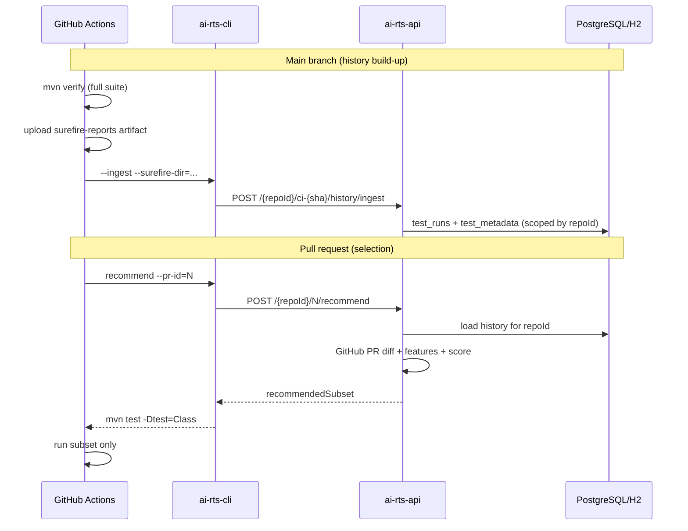

# AI-powered Regression Test Selector (AI-RTS) — Project Status

## Targets (MVP v1)
- **Inputs**: GitHub PR diff + historical JUnit/Allure-style test run data (JIRA intentionally **not used**)
- **Outputs**:
  - ranked list of tests to run (aiming 30–60% of suite)
  - recommended fast subset (target <10 minutes total)
- **Goals**: 90%+ regression recall, <10s latency per PR (with caching), Java 17, Maven, JUnit 5
- **Constraints**: pure Java where possible (ONNX optional), H2 for PoC, Spring Boot 3.x

## Architecture (implemented)
Data ingestion → Feature engineering → Model service (ONNX optional) → Recommendation engine → REST API/CLI → CI integration

## What is built now

### 1) Maven multi-module structure
Root folder: `ai-rts/`
- `ai-rts/pom.xml` (parent)
- `ai-rts/core/` (domain + logic)
- `ai-rts/api/` (Spring Boot REST)
- `ai-rts/cli/` (standalone runner)
- `ai-rts/integration/` (CI artifacts + simulation test)

### 2) Core module (`ai-rts/core`)
- **Entities** (repo-scoped):
  - `TestRun` (repoId, testId, result, duration, timestamp, prId)
  - `TestMetadata` (repoId, className, methodName, tags, type, avgDuration)
  - `CodeChange` (filePath, linesAdded, linesRemoved, methodsTouched)
- **Repositories** (Spring Data JPA, filtered by `repoId`):
  - `TestRunRepository`, `CodeChangeRepository`, `TestMetadataRepository`
- **Services**:
  - `GitCloneService` (GitHub PR files diff ingestion via GitHub API; supports `GITHUB_TOKEN`)
  - `TestHistoryService` (loads metadata/runs **per repo** from DB)
  - `TestHistoryIngestionService` (ingests JUnit XML + Allure result JSON into DB)
  - `FeatureExtractor` (12 features: recency-weighted fail rate, flakiness transitions, package overlap with PR diff, critical/integration tags, etc.)
  - `ModelService` (ONNX detection via reflection + heuristic fallback scoring)
  - `RecommendationEngine` (ranking + subset selection; **always includes `@critical`-tagged tests**; 40% count cap + 10 min budget)
- **Unit tests**: feature extraction, recommendation, JUnit XML parser, GitHub repo URL parser

### 3) API module (`ai-rts/api`)
- Spring Boot app: `com.ai.rts.api.ApiApplication`
- Endpoints:
  - `POST /api/v1/{repoId}/{prId}/recommend`
  - `POST /api/v1/{repoId}/{prId}/history/ingest`
- **Optional Bearer auth**: env `AI_RTS_API_TOKEN` on server (`ai.rts.api-token` in `application.yml`)
- **Flyway** schema (`V1__init.sql`) with repo-scoped indexes
- **Profiles**:
  - default: H2 in-memory + Flyway
  - `prod`: PostgreSQL via `DATABASE_URL`, `DATABASE_USERNAME`, `DATABASE_PASSWORD`
- **Integration test**: `RecommendFlowTest` — ingest real Surefire XML → recommend (end-to-end in-process)

### 4) CLI module (`ai-rts/cli`)
- **`--ingest`**: POST Surefire/Allure files to `/history/ingest` (Bearer via `--api-token` or env)
- **Recommend**: `--api-url`, `--repo-url`, `--pr-id` → prints `mvn test -Dtest=...` (Bearer auth supported)
- On failure: falls back to `mvn test` (CI-safe)

### 5) CI workflows (`.github/workflows/`)
| Workflow | Trigger | Purpose |
|----------|---------|---------|
| `ai-rts-ci.yml` | push/PR to main | Build + test; upload Surefire XML artifact |
| `ai-rts-history-ingest.yml` | after green push to main | Download artifact → CLI `--ingest` → deployed API |
| `ai-rts-pr-select.yml` | pull_request | CLI recommend → run selected Maven tests |

## Real data flow (production path)



## Deploy the API (minimum for real data)

1. **Run with PostgreSQL** (recommended — H2 resets on restart):
   ```bash
   export SPRING_PROFILES_ACTIVE=prod
   export DATABASE_URL=jdbc:postgresql://host:5432/airts
   export DATABASE_USERNAME=airts
   export DATABASE_PASSWORD=secret
   export AI_RTS_API_TOKEN=your-shared-secret   # optional but recommended
   export GITHUB_TOKEN=ghp_...                  # for PR diff fetch
   java -jar api/target/api-0.1.0-SNAPSHOT.jar
   ```

2. **Configure GitHub repo secrets**:
   - `AI_RTS_API_BASE_URL` — e.g. `https://your-selector.example.com`
   - `AI_RTS_API_TOKEN` — same value as server (if auth enabled)
   - `AI_RTS_REPO_ID` — optional; defaults to repository name

3. **First ingest**: push to main → `ai-rts-history-ingest` runs after CI → DB populated.

4. **PR selection**: open a PR → `ai-rts-pr-select` calls API → runs subset.

## Known gaps (next iterations)
- **ONNX inference** not wired to a trained model file (heuristic fallback only)
- **PR diff coupling** is file/package overlap; JavaParser call-graph coupling not yet implemented
- **Latency caching** (PR feature cache, repo clone cache) not added
- **Retention policy** for old test runs not implemented
- **Per-repo API keys / JWT** — shared Bearer token only today

## How to run locally

### Build
From repository root:
```bash
mvn -f ai-rts/pom.xml clean verify
```

### Run API + ingest + recommend
Terminal 1:
```bash
java -jar ai-rts/api/target/api-0.1.0-SNAPSHOT.jar
```

Terminal 2 (ingest this project's Surefire reports):
```powershell
java -jar ai-rts/cli/target/cli-0.1.0-SNAPSHOT.jar --ingest --api-url=http://localhost:8080 --repo-id=myrepo --correlation-id=ci-local-1 --surefire-dir=ai-rts/core/target/surefire-reports
```

Terminal 3 (recommend):
```powershell
java -jar ai-rts/cli/target/cli-0.1.0-SNAPSHOT.jar --api-url=http://localhost:8080 --repo-url=https://github.com/org/repo --repo-id=myrepo --pr-id=1 --output-format=surefire
```

## Phase roadmap

| Phase | Status | Notes |
|-------|--------|-------|
| 1 Real data path | ✅ Done | Ingest + history workflow + repo scoping |
| 2 Better features | ✅ Partial | Recency fail rate, flakiness, package overlap, critical-always |
| 3 ONNX inference | ✅ Done | `rts-v1.onnx` bundled; `OnnxModelRunner` + train script; heuristic fallback |
| 4 CI PR selection | ✅ Done | `ai-rts-pr-select.yml` |
| 5 Production deploy | ✅ Ready | Render + Neon; see [`DEPLOY.md`](DEPLOY.md) |
